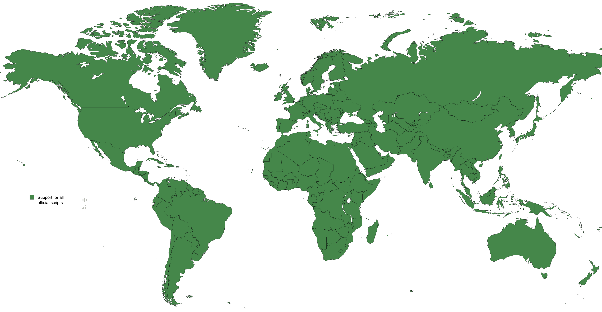
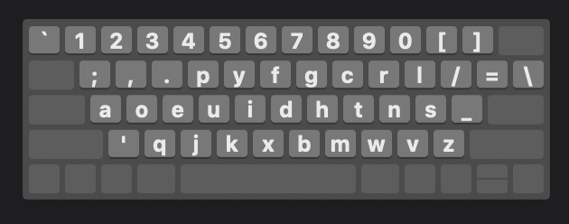
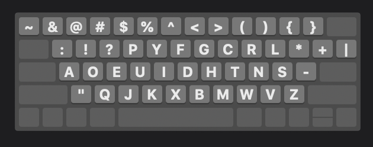
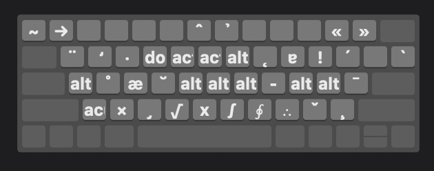
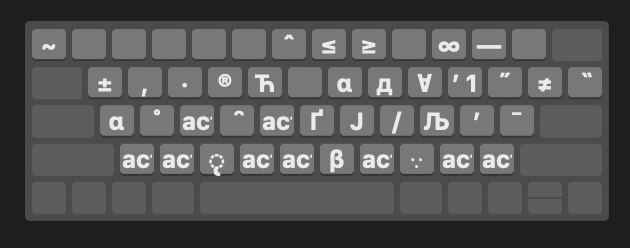

# Ṣymβoar∂

Type anything.

## Why?

It's needlessly hard to type! Symbols like θ, π, and √ are incredibly common in handwriting. And yet, almost impossible to type on a computer. This isn't just a problem in math, but also in linguistics, and for bilingual people.
You shouldn't have to learn a new keyboard layout for every new language, or look up where to find θ on your keyboard. Or worse yet, google a symbol and copy-paste.

**This keyboard makes it easy to type. Even symbols.**

**If you study math, you can type math symbols. If you're bilingual, you can type in your other language. If you study linguistics, you can type linguistics notation.**

There are 2 ways to achieve this:
1. Type characters by using graphically similar characters
2. Make users memorize 1 romanization system for all scripts, and have them learn a few exceptions for each script

We use a universal romanization scheme based on phonetics, which maps to the letters in every other alphabet. Diacritics can be found near or above graphically similar characters, so that ȧ = a + .
Therefore, if i want to type russian but i don't know how to write it, that i can close my eyes and type russian. I'd type "andrej" and get "андрей".

### Design tenets

This keyboard was designed according to the following tenets:

1. *Make typing in english fast, comfortable, and low-effort*
  - The alphabet is arranged in the Dvorak layout. Common English punctuation is all in the lower 3 rows
2. *Support other common symbols in an intuitive way (EG greek, cyrillic, arrows, math symbols)*
  - Our universal romanization scheme maps all non-latin characters to similar sounding latin letters. For example, ك = k, к = k, and か = k + a.
  - Diacritics are placed near or above graphically similar characters. For example, ȧ = a + .

## Layout

The basic layout is as follows:

Pressing the shift and alt keys will provide access to different key sets, including modifier keys. These are presented below.

|                    | Shift not pressed                                                       | Shift pressed                                                        |
|--------------------|-------------------------------------------------------------------------|----------------------------------------------------------------------|
| **Alt not pressed** |  |      |
| **Alt pressed**      |           |  |

## Compatibility

Below is a map of the world showing the countries where some or all of the administrative languages can be written using Symboard.

This keyboard is compatible with (at least) the following scripts:

Albanian, Arabic, romanization (ALA-LC; ISO), Arabic, Asturian, Azerbaijani, Belarusian, Bengali, Bosnian (cyrllic; latin scripts), Breton, Bulgarian, Burmese, Chinese Mandarin (pinyin), Cyrillic (romanization, ISO 9), Czech, Danish, Dutch, Dzongkha, English, Esperanto, Estonian, Faroese, Farsi / Dari / Persian, Filipino, French, Galician, Ge'ez, Georgian (mkhedruli), German, Greenlandic, Hawaiian, Hebrew, Hindi, Hungarian, Icelandic, Irish, Italian, Japanese (romaji; hepburn, nihonshiki, kunrei), Khmer, Kurdish, Kurdish (arabic), Lakota, Lao, Latvian, Lithuanian, Macedonian, Manx, Mongolian (cyrillic; mongolian), Montenegrin, Māori, Nepalese, Norwegian (bokmal, nynorsk), Pashto, Polish, Portuguese, Qazaq (latin script), Romanian, Russian, Scottish Gaelic, Serbian, Slovak, Slovenian, Sinhala, Spanish, Swedish, Tamil, Thai, Tibetan, Tifinagh, Turkish, Ukrainian, Urdu, Uzbek, Vietnamese, Welsh

We plan to support Korean in future.

## FAQ

#### Problem 1
Q: Isn't it slow to type if every language has the same romanization scheme?
A: To save time typing, if a letter in the basic 26 letters is unused, then we fill that slot with a similar-sounding letter.

#### Problem 1
Languages have messy writing systems. English has 3 letters that all make the /k/ sound (q; k; c), and many languages also have the same kind of problem. 
*Solution*: For these cases, we use "t", "t1" and "t2", and which one is which will be sorted alphabetically. So in English, you can imagine that "c" maps to "k", "k" maps "k1", and "q" maps to "k2".

#### Problem 2
Many non-latin alphabets have letters for sounds that latin doesn't have, especially sounds like "ts", "ch", "zh", and "sh".
*Solution*: Use the universal romanization scheme, and allow typing of diacritics. To get russian "ц", type "ts". To get "тс", type "t-s". Common sounds like "sh" are simply "x".

#### Example 1
- Perso-Arabic script has a /gh/ sound and a /g/ sound.
- Greek has a single letter which can sound like /gh/ or /g/.
Therefore, Greek would allow you to simply type /g/, But in perso-arabic script, there is a separate letter for /g/ and /gh/. So you would have to distinguish the two when you write Persian.
